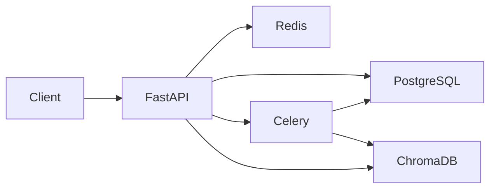

# AI Knowledge API

Portfolio backend project: a document Q&A API with **vector search** (ChromaDB), background embedding jobs (**Celery + Redis**), query caching, and **JWT** auth. Answers are built from retrieved passages (no external LLM API required for the demo; CI uses a mock mode).

## Tech stack

| Layer | Technology |
|-------|------------|
| API | FastAPI, Python 3.11+ |
| Database | PostgreSQL (SQLAlchemy) |
| Vectors | ChromaDB |
| Background jobs | Celery + Redis |
| Cache | Redis |
| Deploy | Docker Compose |

## Features

- **JWT authentication** — `/auth/signup`, `/auth/login`
- **Document upload** — PDF and `.txt` via `/documents/upload`
- **Async embedding** — Celery worker chunks text and indexes into ChromaDB
- **Semantic search / RAG-style query** — `/query/` retrieves top passages from ChromaDB and returns a stitched answer (optional `RAG_MOCK` for local/CI without Chroma)
- **Query caching** — Redis caches responses per user + query hash
- **OpenAPI docs** — http://localhost:8000/docs

## Architecture



## Quick start

```bash
cp .env.example .env
docker compose up -d --build
```

- API: http://localhost:8000  
- Swagger: http://localhost:8000/docs  
- Chroma (host): http://localhost:8001  

### Local development (without Docker)

```bash
python -m venv .venv
.venv\Scripts\activate   # Windows
pip install -r requirements.txt
uvicorn app.main:app --reload
```

Run Celery in a second terminal:

```bash
celery -A app.tasks:celery_app worker --loglevel=info
```

## Example flow

1. **Register**

```http
POST /auth/signup
{
  "first_name": "Alex",
  "email": "alex@example.com",
  "password": "securepass123"
}
```

2. **Upload** (Bearer token required)

```http
POST /documents/upload
Content-Type: multipart/form-data
file: report.pdf
```

3. **Query**

```http
POST /query/
Authorization: Bearer <access_token>
{ "query": "What are the main risks mentioned?" }
```

Response:

```json
{
  "answer": "...",
  "sources": ["report.pdf"],
  "cached": false
}
```

## Tests & CI

```bash
pip install -r requirements.txt
pytest -v
```

CI runs on push/PR via `.github/workflows/ci.yml` (SQLite + mock RAG, no external services required).

## Project structure

```
app/
├── main.py           # FastAPI entry
├── api/              # auth, upload, query routes
├── models.py         # User, Document
├── tasks.py          # Celery embedding worker
├── utils.py          # JWT, RAG, Redis cache
├── config.py         # Settings from env
└── database.py       # SQLAlchemy session
```

## Environment variables

See [`.env.example`](.env.example). Set strong `JWT_SECRET_KEY` values before deploying.

## License

MIT — portfolio / learning project.
